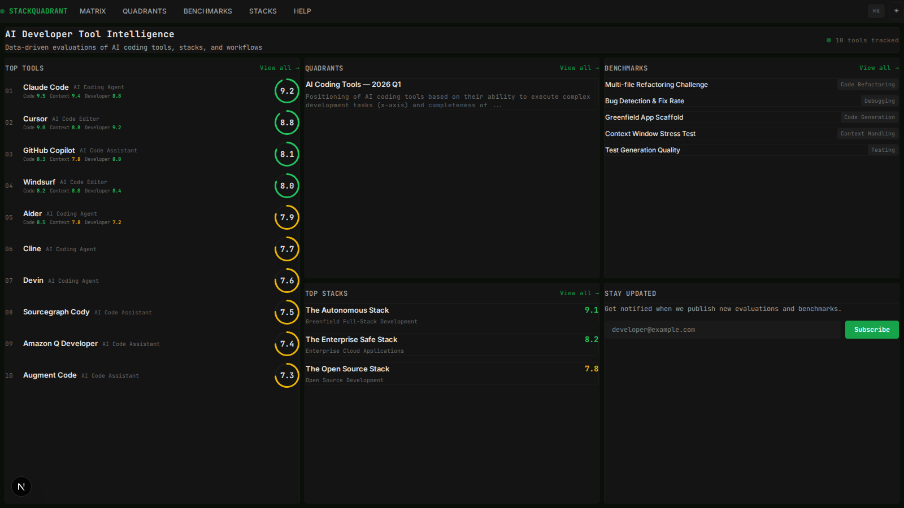

# StackQuadrant

A data-driven intelligence platform for evaluating AI developer tools. Think Gartner Magic Quadrant, but built by developers for developers.



## Features

- **AI Tool Capability Matrix** — Score tools across 6 dimensions (Code Generation, Context Understanding, Developer Experience, Multi-file Editing, Debugging & Fixing, Ecosystem Integration)
- **Magic Quadrants** — Interactive 2D positioning charts showing tool landscape (Leaders, Visionaries, Challengers, Niche)
- **Real-World Benchmarks** — Structured benchmark results for AI coding tasks
- **Stack Ratings** — Evaluate tool combinations for specific development workflows
- **Contextual Tooltips** — Hover any score, dimension header, or metric for explanations with evidence
- **In-App Help** — Comprehensive guide to scores, navigation, and methodology at `/help`
- **Command Palette** — `Cmd+K` / `Ctrl+K` search across all tools, quadrants, benchmarks, and stacks
- **Dark/Light Theme** — worldmonitor.app-inspired intelligence dashboard aesthetic
- **Responsive Ultrawide Layout** — Viewport-filling grid that scales from laptops to 34"+ ultrawide monitors
- **Admin Dashboard** — Full CRUD for managing all content
- **Evaluation Methodology** — Transparent scoring process documentation at `/methodology`

## Tech Stack

- **Framework**: Next.js 16 (App Router, Server Components, API Routes)
- **Database**: PostgreSQL 16 with Drizzle ORM
- **Styling**: CSS Custom Properties design tokens + Tailwind CSS utilities
- **Visualizations**: Custom SVG components (score rings, radar charts, quadrant charts, score bars, sparklines)
- **Animations**: Framer Motion
- **Auth**: JWT (jose + bcryptjs)
- **Search**: cmdk command palette
- **Typography**: JetBrains Mono (data) + Inter (UI)

## Quick Start

### Prerequisites

- Node.js 18+
- PostgreSQL 16 (or Docker)

### Setup

```bash
# Clone the repository
git clone https://github.com/samibs/StackQuadrant.git
cd StackQuadrant

# Install dependencies
npm install

# Start PostgreSQL (if using Docker)
docker compose up -d

# Copy environment variables
cp .env.example .env
# Edit .env with your DATABASE_URL if needed

# Push database schema
npm run db:push

# Seed with sample data (15 AI tools, benchmarks, stacks)
npm run db:seed

# Start development server
npm run dev
```

Open [http://localhost:3000](http://localhost:3000) to view the app.

### Admin Access

After seeding, log in at `/admin/login`:
- **Email**: `admin@stackquadrant.dev`
- **Password**: `admin123!`

## Project Structure

```
src/
├── app/
│   ├── page.tsx                    # Dashboard (3-col viewport-filling grid)
│   ├── matrix/                     # Capability matrix (sortable, filterable)
│   ├── quadrants/                  # Magic quadrant views (responsive SVG)
│   ├── tools/[slug]/               # Tool detail (radar chart, dimension scores)
│   ├── benchmarks/                 # Benchmark results
│   ├── stacks/                     # Stack ratings
│   ├── methodology/                # Evaluation methodology
│   ├── help/                       # In-app help & user guide
│   ├── admin/                      # Admin dashboard (CRUD)
│   └── api/v1/                     # REST API
│       ├── tools/                  # Public tool endpoints
│       ├── quadrants/              # Public quadrant endpoints
│       ├── benchmarks/             # Public benchmark endpoints
│       ├── stacks/                 # Public stack endpoints
│       ├── search/                 # Search index
│       ├── auth/login/             # Admin authentication
│       ├── subscribers/            # Newsletter signup
│       └── admin/                  # Admin CRUD endpoints
├── components/
│   ├── layout/                     # Header, Panel, ThemeProvider
│   ├── visualizations/             # ScoreRing, RadarChart, QuadrantChart, ScoreBar, Sparkline
│   └── ui/                         # Tooltip, InfoIcon, Skeleton, CommandPalette
├── lib/
│   ├── db/                         # Schema, queries, seed
│   ├── hooks/                      # useAdmin hook
│   └── utils/                      # API helpers, auth
└── styles/
    └── tokens.css                  # Design tokens (dark/light themes)
```

## Scoring System

All tools are scored on a **0-10 scale** across six dimensions:

| Score Range | Color | Meaning |
|-------------|-------|---------|
| 8.0 - 10.0 | Green | Excellent |
| 5.0 - 7.9 | Yellow | Average |
| 0.0 - 4.9 | Red | Below average |

The **Overall Score** is a weighted average of all dimension scores. Hover any score in the app for context-specific explanations.

## API Endpoints

### Public (no auth required)

| Method | Endpoint | Description |
|--------|----------|-------------|
| GET | `/api/v1/tools` | List published tools (paginated, sortable, filterable) |
| GET | `/api/v1/tools/:slug` | Tool detail with scores, benchmarks, stacks |
| GET | `/api/v1/quadrants` | List published quadrants |
| GET | `/api/v1/quadrants/:slug` | Quadrant with tool positions |
| GET | `/api/v1/benchmarks` | List published benchmarks |
| GET | `/api/v1/benchmarks/:slug` | Benchmark with results |
| GET | `/api/v1/stacks` | List published stacks |
| GET | `/api/v1/stacks/:slug` | Stack with tools and metrics |
| GET | `/api/v1/search` | Search index for command palette |
| POST | `/api/v1/subscribers` | Newsletter signup |
| GET | `/api/health` | Health check |

### Admin (JWT required)

| Method | Endpoint | Description |
|--------|----------|-------------|
| POST | `/api/v1/auth/login` | Admin login |
| GET/POST | `/api/v1/admin/tools` | List/create tools |
| GET/PUT/DELETE | `/api/v1/admin/tools/:id` | Tool CRUD |
| PUT | `/api/v1/admin/tools/:id/scores` | Update tool dimension scores |
| GET/POST | `/api/v1/admin/quadrants` | List/create quadrants |
| PUT/DELETE | `/api/v1/admin/quadrants/:id` | Quadrant CRUD |
| PUT | `/api/v1/admin/quadrants/:id/positions` | Update tool positions |
| GET/POST | `/api/v1/admin/benchmarks` | List/create benchmarks |
| PUT/DELETE | `/api/v1/admin/benchmarks/:id` | Benchmark CRUD |
| POST | `/api/v1/admin/benchmarks/:id/results` | Add benchmark results |
| GET/POST | `/api/v1/admin/stacks` | List/create stacks |
| PUT/DELETE | `/api/v1/admin/stacks/:id` | Stack CRUD |

## Database Commands

```bash
npm run db:generate    # Generate migration files
npm run db:migrate     # Run migrations
npm run db:push        # Push schema (dev mode)
npm run db:seed        # Seed sample data
npm run db:studio      # Open Drizzle Studio
```

## Keyboard Shortcuts

| Shortcut | Action |
|----------|--------|
| `Cmd+K` / `Ctrl+K` | Open command palette |
| `Esc` | Close command palette / dialogs |

## License

MIT
